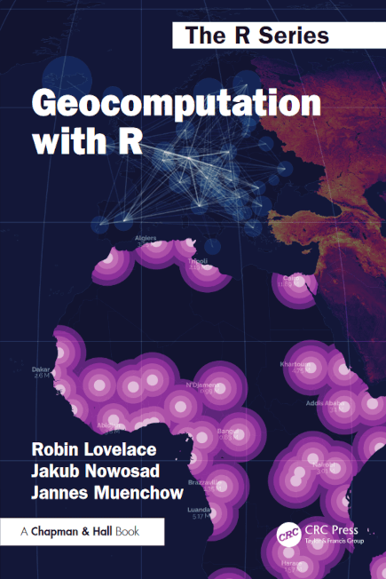
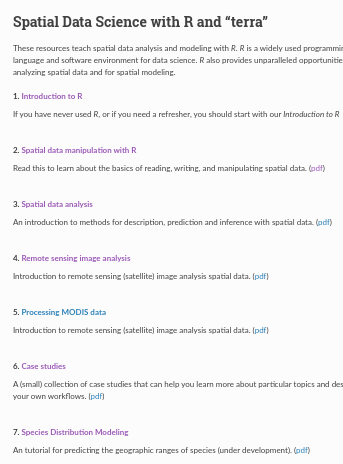
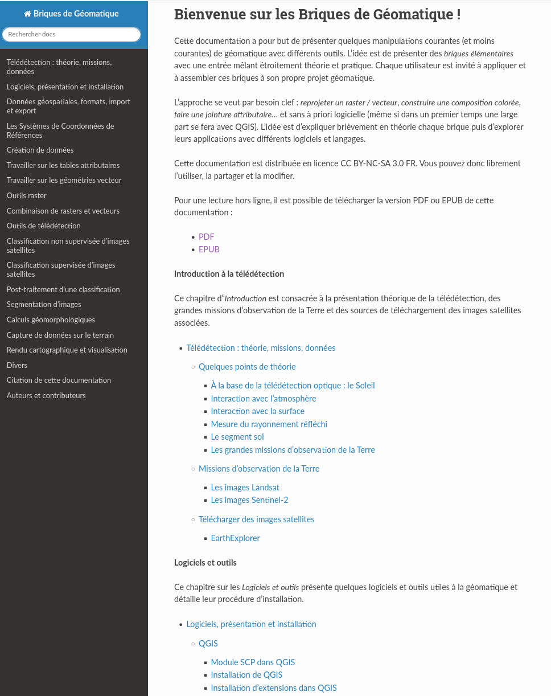

# *Préambule* {.unnumbered}

Le logiciel R permet depuis longtemps de traiter les données spatiales, 
plusieurs packages forment un socle permettant la mise en œuvre de ces traitements.
Les développements actuels s'appuient sur ce socle et forment un écosystème robuste 
qui offre aux utilisateurs la plupart des fonctionnalités autrefois réservées 
aux Systèmes d'Information Géographique, et cela dans un environnement favorable 
à la reproductibilité des résultats de recherche.

Ce manuel est destiné tant aux utilisateurs de R souhaitant mettre en place des 
traitements de données spatiales qu'aux utilisateurs souhaitant utiliser R 
pour réaliser les tâches qu'ils réalisent habituellement avec un SIG.

**Comment utiliser le manuel**  
Les données utilisées dans ce document sont stockées dans un projet RStudio. 
Vous devez le télécharger puis le décompresser sur votre machine. Il vous sera ensuite possible de tester l'ensemble des manipulations proposées dans ce document au sein du projet **geodata**.  
[Télécharger le projet](https://github.com/rgeocarto/geodata/releases/download/v1.0.0/geodata.zip){.btn .btn-primary .btn-sm role="button"}  

**Contribution et feedback**  
Vous pouvez nous envoyer vos remarques et suggestions en 
[postant une *issue*](https://github.com/rgeocarto/rgeocarto.github.io/issues) 
sur le [dépôt GitHub](https://github.com/rgeocarto/rgeocarto.github.io/) de ce document. 

**Voir aussi : **

::: {layout="[[1,1,1,1,1], [0,1,1,1,0]]"}

:::

<small>
**Pour citer le document :**  

Giraud, T. et Pecout, H. (2025). Géomatique et cartographie avec R. https://doi.org/10.5281/zenodo.17987558

</small>

  
   

{height=60px fi-align="center"}
